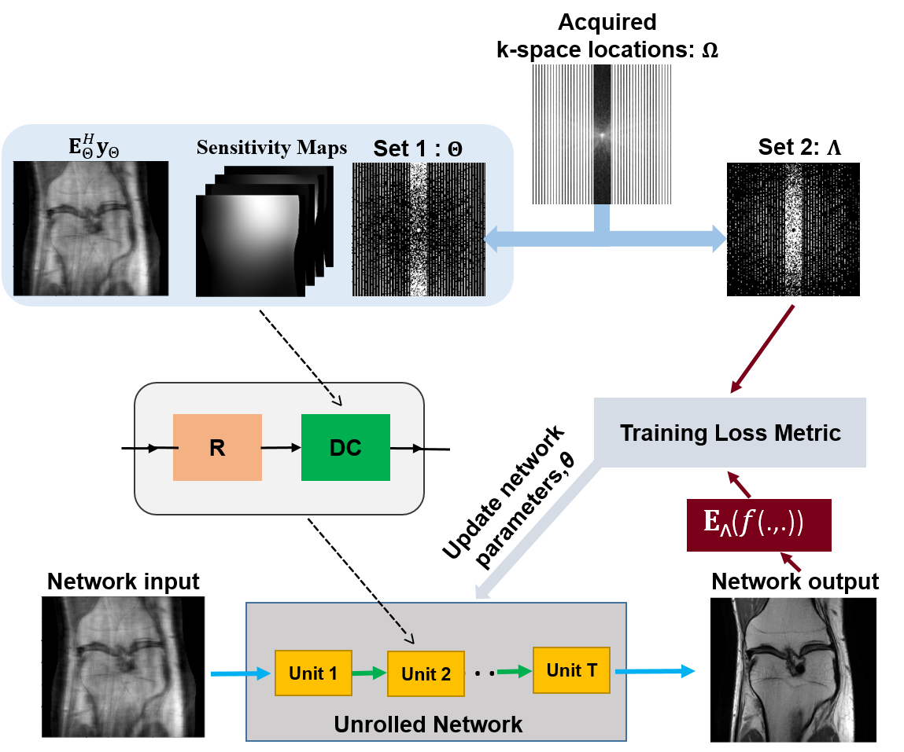
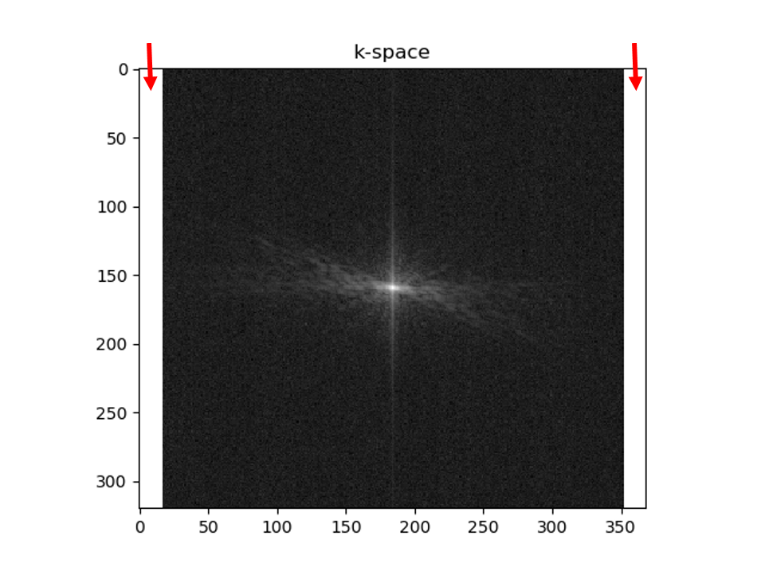

# SSDU: Self-Supervision via Data Undersampling
SSDU enables physics-guided deep learning MRI reconstruction without fully-sampled data ([paper](https://onlinelibrary.wiley.com/doi/abs/10.1002/mrm.28378)).
Succintly, SSDU splits acquired measurements <b>Ω</b> into 2 disjoint sets, <b>Θ</b> and <b>Λ</b>.
<b>Θ</b>  is used in the data consistency units of the unrolled network and <b>Λ</b> is used to define the loss in k-space.

 <br>

*The self-supervised learning scheme to train physics-guided deep learning without fully sampled data. The acquired subsampled
k-space measurements, Ω, are split into two disjoint sets, Θ and Λ. The first set of indices, Θ, is used in the data consistency unit of the unrolled
network, whereas the latter set, Λ, is used to define the loss function for training. During training, the output of the network is transformed to
k-space, and the available subset of measurements at Λ are compared with the corresponding reconstructed k-space values. Based on this training
loss, the network parameters are subsequently updated.*


## Installation
Dependencies are given in environment.yml. A short list of the required packages to run SSDU codes are given in requirements.txt.
Requirements can be installed in an environment with
```
pip install -r requirements.txt
```
## Datasets
We have used the [fastMRI](https://fastmri.med.nyu.edu/) dataset in our experiments.

We have provided a saved model using Coronal proton density dataset. However, we recommend to retrain SSDU for fair comparisons as we can not share the dataset.

Moreover, SSDU is agnostic to CNN architecture. Hence, it should be retrained with the matching CNN for fair comparisons
## How to use
SSDU training can be performed by running `train.py` file. Prior to running training file, hyperparameters such as number of unrolled blocks, split ratio (<b>ρ</b>) for training and loss masks can be adjusted from `parser_ops.py`. `train.py` file retrieves directories of datasets (kspace, sensitivity maps and mask) from `get_train_directory.py` in `utils.py` file. Users should set these directories prior to running `train.py` file.

`train.py`  file generates a test model and save them to the directory defined by user. Testing can be performed by running `test.py` file. `test.py` retrieves directories of datasets as well as  saved training model from `get_test_directory.py` in `utils.py` file. Users should set these directories prior to running `test.py` file.

We highly recommend the users to set the outer k-space regions with no signal (see below figure) as 1 in training mask to ensure consistency with acquired measurements. This should be done for both `train.py` and `test.py` files.
 <br>
*Red arrows points at the outer k-space regions with no signal (in this example, first 17 columns and last 17 columns of k-space have no signal). These regions should be set as 1 in the train mask to ensure data consistency. For knee dataset used in our experiments, this can be done as (see lines 81-83 in `train.py` and 40-42 in `test.py`)*
```
# %%  zeropadded outer edges of k-space with no signal
if args.data_opt == 'Coronal_PD':
    trn_mask[:, :, 0:17] = np.ones((nSlices, args.nrow_GLOB, 17))
    trn_mask[:, :, 352:args.ncol_GLOB] = np.ones((nSlices, args.nrow_GLOB, 16))
```

## Citation
If you use these codes, please cite
```
@Article{yaman2020self_mrm,
   Author="Yaman, Burhaneddin and Hosseini, Seyed Amir Hossein and Moeller, Steen and Ellermann, Jutta and Ugurbil, Kamil and Akcakaya, Mehmet",
   Title="{Self-Supervised Learning of Physics-Guided Reconstruction Neural Networks without Fully-Sampled Reference Data}",
   Journal="Magnetic Resonance in Medicine",
   Year="2020",
   Volume="84",
   Number="6",
   Pages="3172--3191",
   Month="Dec"
}

@inproceedings{yaman2020self_isbi,
  title={Self-supervised physics-based deep learning MRI reconstruction without fully-sampled data},
  author={Yaman, Burhaneddin and Hosseini, Seyed Amir Hossein and Moeller, Steen and Ellermann, Jutta and Ugurbil, Kamil and Akcakaya, Mehmet},
  booktitle={ Proc. IEEE Int. Symp. Biomed. Imag. (ISBI)},
  pages={921--925},
  year={2020},
  organization={IEEE}
}
```


# Questions
If you have questions or issues, please open an issue or reach out to me at yaman013 at umn.edu .
